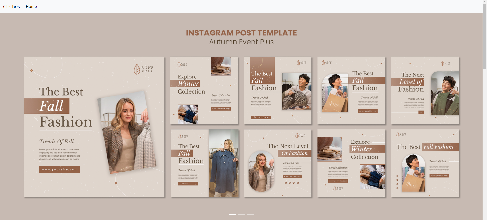

# Exemplo de site para um catálogo de roupas feminino online :dress:

## Como utilizar?
###  1.Clonar o repositório
#### https://github.com/SenaiMG/desenvolvimento-web-RebecaVelasc0.git

### 2.Ativar venv
